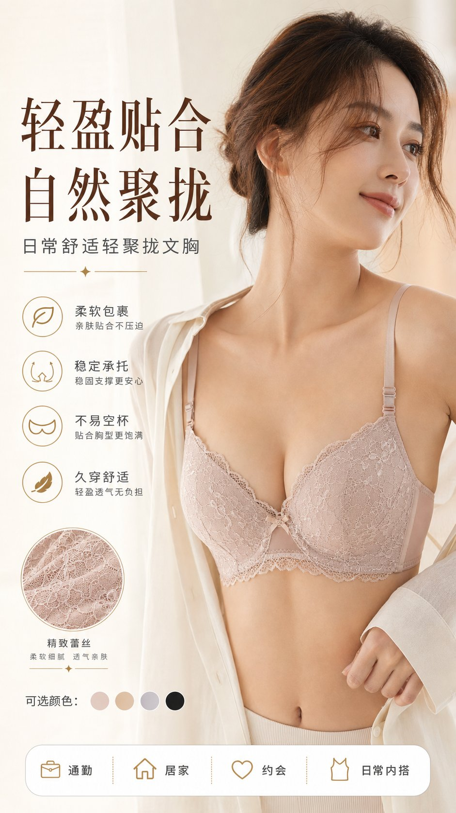
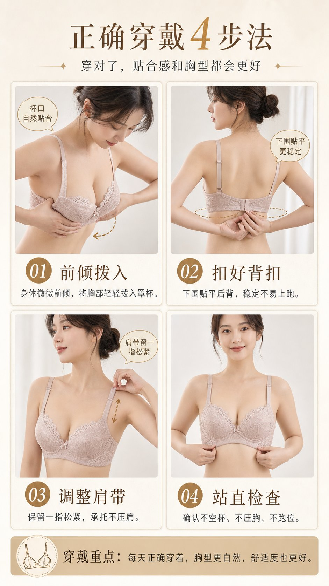
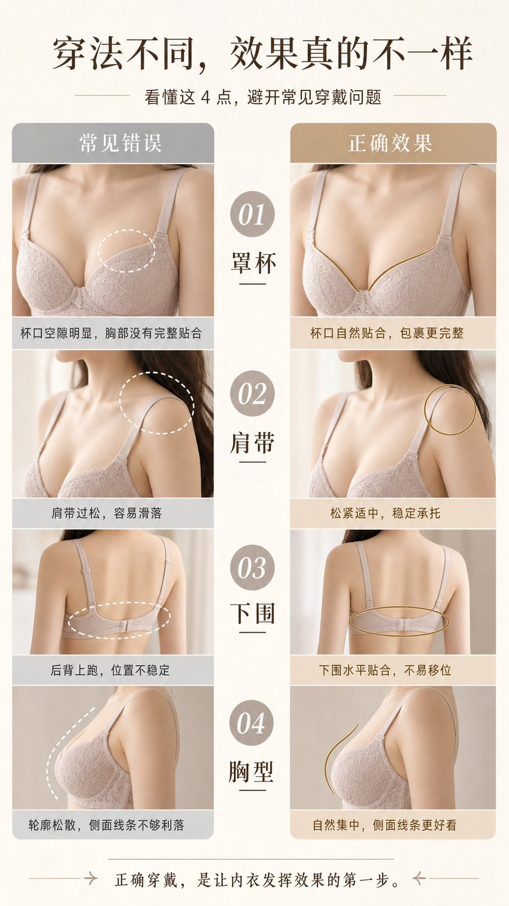
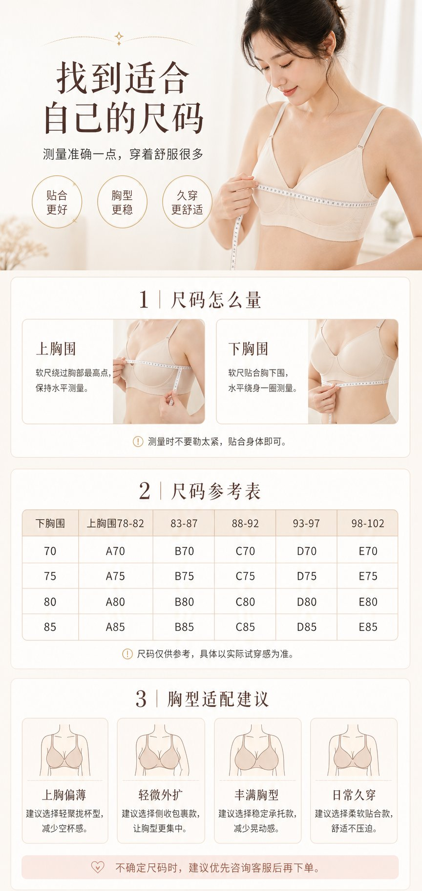

# 用 KNA Chat 一次跑出一套内衣电商详情页

> 4 张图 · 同一模特 · 同一产品 · 同一视觉语言 · 总成本 ≈ **$0.08**（按 GPT Image 2.0 单张 $0.02 计）。
> 对比设计外包（¥2000+）省 99%；对比真人模特拍摄（¥5000+ 起）省 99.9%。

## 成果

| # | 主题 | 预览 |
|---|---|---|
| 1 | 主视觉首图 |  |
| 2 | 正确穿戴 4 步法 |  |
| 3 | 穿法对比图 |  |
| 4 | 尺码 + 胸型适配 |  |

每张都是独立竖版详情图，但 4 张连起来像同一个品牌出的整套详情页：

- 模特、产品、色系（米杏 + 浅粉 + 雾黑）全部统一
- 卖点写在主图（柔软包裹 / 稳定承托 / 不易空杯 / 久穿舒适）
- 教程图带 STEP 编号 + 动作示意（前倾拨入 → 扣好背扣 → 调整肩带 → 站直检查）
- 对比图 4 个维度（罩杯 / 肩带 / 下围 / 胸型）×（错误 / 正确）
- 尺码图含测量示意 + A70-E85 尺码表 + 4 种胸型适配建议

## 怎么跑

1. 打开 [chat.wearekna.com](https://chat.wearekna.com)（KNA Chat）
2. 输入框右下角模型选择器 → 切到 **GPT Image 2.0**（KNA 内部 alias，对应 OpenAI `gpt-image-1`）
3. 数量选 **1**（4 张图各自独立生成 → 跑 4 轮，每轮单独 prompt 一张）
4. 把下面 prompt 拆成 4 段，每段一轮，对应 4 张图

> 直接整段 prompt 喂进去会让模型试图把 4 张图合并成一张拼图。**必须分 4 轮单独跑**才能出独立竖版图。

## 成本

| 项 | 金额 |
|---|---|
| 4 张 × $0.02 / 张 | $0.08 |
| KNA 引流期 1.5 折 折后实付 | **$0.08 USD ≈ ¥0.57** |

（KNA Chat 显示在每条回复下方："今日已用 X/20"，按 OpenAI 实际 token 计费）

## 完整 prompt

复制下面这段，每个 `【第 N 张】` 部分单独发一轮（共 4 轮）：

````markdown
# 内衣电商详情页系列 - 通用规则

请为一款日常舒适聚拢型内衣（或轻熟蕾丝文胸）生成 1 张电商详情图。

**关键输出规则：**
- 单张独立输出（不要做四宫格 / 长条总拼图）
- 竖向电商详情页版式
- 写实商业摄影 + 日系高级感
- 真实模特上身效果（成年女性，气质自然、健康，不夸张、不低俗）
- 干净留白 + 柔和自然光
- 色系：奶白 / 米杏 / 浅粉 / 豆沙 / 浅灰 / 雾黑 等低饱和高级配色
- 不要出现品牌 logo / 水印 / 平台标识
- 文字简洁清楚（标题 + 卖点小标 + 必要标注），不要乱码错字

**系列统一要求：**
4 张图必须使用同一个模特、同一件产品、同一套色系、同一视觉语言。
整套像同一品牌详情页的 4 个模块。

---

## 【第 1 张：主视觉首图】

主题：产品主视觉详情图。建立第一印象 + 突出气质与核心卖点。

- 成年女性模特上身主视觉（正面或微侧面）
- 背景干净高级，可带轻微生活方式氛围
- 突出胸型轮廓、贴合感、肩带、下围稳定感

文案结构：
- 主标题：**轻盈贴合，自然聚拢**
- 副标题：日常舒适聚拢内衣
- 4 条卖点短句：
  - 柔软包裹（亲肤贴合不压迫）
  - 稳定承托（稳固支撑更安心）
  - 不易空杯（贴合胸型更饱满）
  - 久穿舒适（轻盈透气无负担）
- 底部：可选颜色色块 + 适合场景标签（通勤 / 居家 / 约会 / 日常内搭）

---

## 【第 2 张：穿戴教程图】

主题：正确穿戴 4 步法。教学专业感 + 提升穿着体验。

- 一张独立详情图内部 2×2 分区
- 同一模特演示 4 个穿戴步骤
- 每一步明确动作 + 简洁说明（每说明 ≤ 18 字）

4 个步骤：
- STEP 01 前倾拨入：身体微微前倾，将胸部轻轻拨入罩杯
- STEP 02 扣好背扣：下围贴平后背，稳定不易上跑
- STEP 03 调整肩带：保留一指松紧，承托不压肩
- STEP 04 站直检查：确认不空杯、不压胸、不跑位

标题：
- 主标题：**正确穿戴 4 步法**
- 副标题：穿对了，贴合感和胸型都会更好

---

## 【第 3 张：正确 / 错误对比图】

主题：4 个维度 × 错误 vs 正确。代入感强 + 转化力高。

- 左右对比布局（左 = 常见错误 / 右 = 正确效果）
- 4 个维度：罩杯 / 肩带 / 下围 / 胸型
- 每个维度配一行说明（错误说明 + 正确说明）

对比内容：
1. 罩杯：杯口空隙明显，胸部没有完整贴合 → 杯口自然贴合，包裹更完整
2. 肩带：肩带过松，容易滑落 → 松紧适中，稳定承托
3. 下围：后背上跑，位置不稳定 → 下围水平贴合，不易移位
4. 胸型：轮廓松散，侧面线条不够利落 → 自然集中，侧面线条更好看

标题：
- 主标题：**穿法不同，效果真的不一样**
- 副标题：看懂这 4 点，避开常见穿戴问题

---

## 【第 4 张：尺码 / 胸型适配图】

主题：测量方法 + 尺码表 + 胸型建议。解决购买最后一层犹豫。

3 个区块：
- **测量方法**：上胸围 + 下胸围 测量示意（带软尺图）
- **尺码参考表**：A70 - E85（4 行 × 5 列：下胸围 70/75/80/85 × 罩杯 A/B/C/D/E）
- **胸型适配建议**：4 种身型 × 推荐杯型
  - 上胸偏薄 → 轻聚拢杯型
  - 轻微外扩 → 侧收包裹型
  - 丰满胸型 → 稳定承托型
  - 日常久穿 → 柔软贴合款

标题：
- 主标题：**找到适合自己的尺码**
- 副标题：测量准确一点，穿着舒服很多
- 底部温馨提示：不确定尺码时，建议优先咨询客服后再下单

---

**质量要求（4 张图都必须满足）：**
- 高清 + 五官自然 + 手部肢体比例准确
- 手部、肩带、罩杯、背扣、面料细节合理
- 文字标题清晰，信息层级分明
- 不能有多余手指 / 肢体变形 / 面料穿帮
- 整体看起来像真实高端品牌电商详情页
````

## 适用场景

这套 prompt 不止能生成内衣详情页。把【产品定位】+【4 张图主题】换成别的，整套结构都能复用：

- 服饰：连衣裙 / 卫衣 / 牛仔裤 / 童装
- 美妆：粉底 / 口红 / 护肤套装（4 步教程 / 色号对比 / 肤质适配）
- 食品：零食礼盒 / 茶叶 / 调味料（产品/吃法/搭配/规格）
- 家居：床品 / 灯具 / 收纳（场景图 / 安装教程 / 风格对比 / 尺寸适配）
- 数码：手机壳 / 耳机 / 充电器（外观/参数/对比/型号适配）

把"穿戴 4 步法"换成"安装 4 步法"、"使用 4 步法"、"搭配 4 步法"，骨架是一致的。

## 工具

- KNA Chat: [chat.wearekna.com](https://chat.wearekna.com) — 中文界面 · GPT Image 2.0 · 每日 20 张配额
- 价格：$0.02 / 张（OpenAI 实际定价，KNA 透传）
- 注册送 100 万 Sonnet token + 20 张图配额，新用户可以免费跑一整套试试

## 反馈

跑出别的好结果欢迎在 [Discussion](https://github.com/damonn92/kna-community/discussions) 里 PR / 评论。或者你想看哪类产品的 prompt 模板，提个 [Issue](https://github.com/damonn92/kna-community/issues) 我们后续加。
